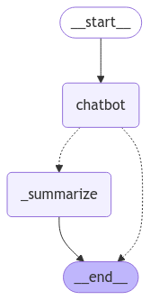

# **SesameBot**  


# 📖 **Description**  
The project can be divided into the chatbot logic and the integration of the API. In addition, a series of tests have been added to check the correct functioning of the API.

## Chatbot Service:
Implements the main service for managing the interactions of a chatbot based on natural language models (LLM). It is a key component responsible for handling the state of conversations, workflows and integration with an LLM model to generate responses and summaries.

### Purpose
The purpose of this module is to provide a robust and scalable framework for:
- Process chatbot conversation states with maintained context.
- Summarize previous dialogs to optimize memory and keep interactions concise.
- Manage a state workflow that enables clear and defined transitions between conversation stages.

### Chatbot workflow
- **Initialization**:
   Initialize an object of the `ChatOpenAI` model is initialized to handle the generated responses.
- **Construction of the graph**:
   A workflow is defined with logic to process messages and summarize conversations.
- **State management**:
   At each stage, messages and transitions are processed according to the context and user interactions.
- **Resumen y Optimización**:
   Old messages are cleaned up and a summary is generated to optimize memory usage without losing the context of the conversation.

### Main features
- **Scalability**: Stateful graph-based implementation allows easy extension of chatbot logic.
- **Memory Optimization**: Automatically reduces old messages while maintaining a summary of the interaction.
- **Persistent Context**: The service ensures that the LLM always receives both the previous context of the conversation and the current messages.
---

## Graph:


## API
Implements the logic of the FastAPI app. It manages the configuration of the API endpoints, interaction with the assistant, and health monitoring for the application.

### **Main features**

- **AI Assistant Integration**: Powers natural language processing and chatbot responses using an AI assistant.
- **FastAPI Framework**: Provides a high-performance RESTful API with easy scalability and clean code structure.
- **Health Monitoring**: Includes a simple endpoint to verify the system's health.
- **Data Validation**: Uses `Pydantic` models to ensure all input and output data is properly validated, improving reliability.

### **How It Works**

1. The application loads environment variables (e.g., OpenAI API keys) via `.env` using the `dotenv` package.
2. The `Assistant` class is initialized to handle message processing and AI integration, enabling conversation generation.
3. The FastAPI application starts, providing the following endpoints:
   - **`POST /chat`**: Accepts user messages and forwards them to the Assistant for processing and response generation.
   - **`GET /health`**: Allows anyone to quickly check that the service is running and healthy.


# 🛠️ Installation Instructions  

### **Local Installation**
1. Clone the repository and switch the branch to feature/add_chatbot:  
   ```bash
   git clone https://github.com/jozapa/chatbot-sesameHR.git
   ```
2. Create a virtual environment with python 3.10 
- **Virtual environment documentation**: https://docs.python.org/3/library/venv.html

3. Go to the project folder:
   ```bash
   cd chatbot-sesameHR
   ```
4. Install dependencies:  
   ```bash
   pip install -r requirements.txt
   ```
5. Create a `.env` in the `src` folder with the `OPENAI_API_KEY`

### **Docker installation**
1. Install Docker
-**Docker documentation**: https://docs.docker.com/desktop/

2. Create a `.env` in the `src` folder with the `OPENAI_API_KEY = "" `

2. Build the docker Image:  
   ```bash
   docker build -t sesamebot .
   ```
---

# ▶️ **How to Execute the Project**  

### **Local Execution**
1. Go to src folder:  
   ```bash
   cd src
   ```
2. Execute:
  ```bash
   python api/main.py
  ```
3. Use the cmd to interact with the bot:

-**Post example**:
   ```cURL
   curl --location 'http://localhost:8000/chat' \
--header 'Content-Type: application/json' \
--data '{
    "user": "Hola"
}'
   ```
You will get a response similar to:
```cURL
{"assistant":"¡Hola de nuevo! ¿Cómo puedo asistirte hoy?"}
```
-**Get example**:
   ```cURL
curl --location 'http://localhost:8000/health' 
   ```
You will get this response:
{"health":"healthy"}
### **Docker execution**
1.  Make sure you have the `Docker Installation` step image installed.
2.  Run the image:
```bash
  docker run -p 8000:8000 sesamebot
   ``` 
3. Use the `cmd` to interact with the bot as before.
---

# ✅ **Tests**
I added tests to validate the functionality of the `/chat` and `/health`API endpoints in the FastAPI application. The tests ensure that the AI assistant behaves as expected under various conditions, including valid and invalid inputs.

### **How to execute the tests**
1. Go to the src folder
2. For test the tests use:
```bash
  pytest test -v
   ``` 
# 🚀 **Next Steps**  


